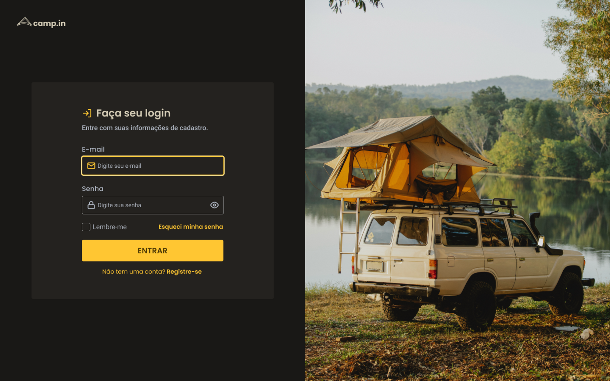

<h1 align="center"> Login Form </h1>
 

  

## 💻 Projeto

Neste desafio você vai criar um formulário de login.

## 🚀 Tecnologias

Esse projeto foi desenvolvido com as seguintes tecnologias:

- HTML e CSS
- Git e Github
- Figma
